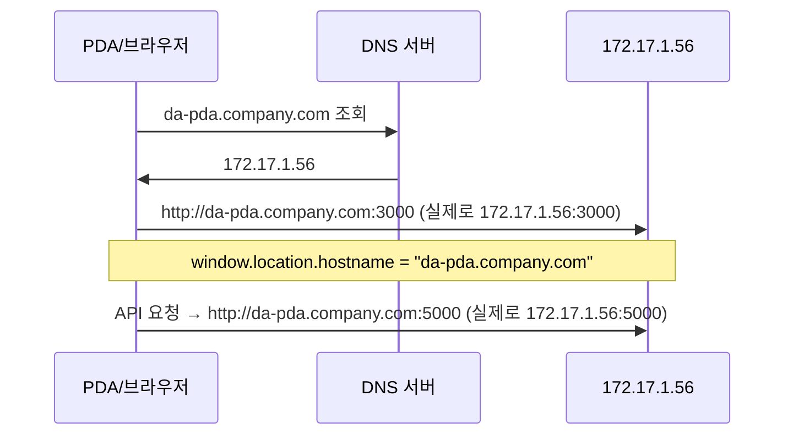

# DNS 주소로 접속하기

## 현재 구조에서의 동작

프론트엔드는 **접속한 URL의 hostname**으로 API 주소를 만든다.

- [client/src/api/axios.ts](client/src/api/axios.ts)의 `getBaseURL()`:
  - 프로덕션에서 `window.location.hostname` 사용
  - 예: `http://da-pda.company.com:3000` 접속 시 API는 `http://da-pda.company.com:5000`으로 요청

따라서 **DNS만** “호스트명 → 172.17.1.56”으로 연결해 주면, 코드 변경 없이 DNS 주소로 접속·API 호출이 가능하다.



---

## 1. DNS 설정 (둘 중 하나 선택)

172.17.1.56은 **사설 IP**이므로, 같은 네트워크(또는 VPN) 안에서만 접근 가능하다. 외부 인터넷 도메인을 이 IP에 붙여도, 외부에서는 직접 접속할 수 없다. 따라서 **내부용 DNS** 또는 **hosts**로 처리하는 것이 일반적이다.

### 방법 A: 내부 DNS 서버 사용 (권장, 기기 일괄 적용)

- **Windows Server DNS**: 172.17.1.56 서버에 DNS 역할이 있거나, 별도 Windows DNS 서버가 있다면  
  - 정방향 조회 영역에 **A 레코드** 추가  
  - 예: `da-pda` (또는 `da-pda.company.local`) → `172.17.1.56`
- **기타 내부 DNS**(BIND, dnsmasq 등)가 있다면 동일하게 A 레코드 추가.

PDA/PC의 DNS 서버를 이 내부 DNS로 설정하면, `http://da-pda:3000` 또는 `http://da-pda.company.local:3000`으로 접속 가능.

### 방법 B: 각 기기 hosts 파일 수정 (DNS 서버 없을 때)

- 접속하는 **각 PDA/PC**에서 hosts 파일에 한 줄 추가:
  - **Windows**: `C:\Windows\System32\drivers\etc\hosts`
  - **Android/iOS**: 루트 필요 또는 앱으로 hosts 수정
- 추가할 줄 예시:
  ```text
  172.17.1.56   da-pda
  ```

- 이후 브라우저에서 `http://da-pda:3000`으로 접속.

정리: **방법 A**는 한 번 설정하면 기기마다 hosts 수정이 필요 없고, **방법 B**는 DNS 서버 없이 빠르게 쓰기 좋다.

---

## 2. 애플리케이션 쪽 (코드 변경 없음)

| 항목 | 상태 |

|------|------|

| 프론트 API base URL | `window.location.hostname` 사용 → DNS로 접속해도 자동으로 해당 호스트명으로 API 호출 |

| 백엔드 CORS | `origin: '*'` → 어떤 호스트명으로 오든 허용 |

| DB 연결 | `172.17.1.56` 또는 `.env`의 `DB_CONNECTION_STRING` — 웹 접속 주소와 무관, 그대로 두면 됨 |

**선택 사항 (문서/로그 정리)**

- [client/src/api/axios.ts](client/src/api/axios.ts): 주석의 "172.17.1.56"을 "서버 호스트명 또는 IP" 등으로 바꾸면 가독성 향상.  
- [server/src/index.ts](server/src/index.ts) 153행: `Server is accessible at http://172.17.1.56:${PORT}` 로그를 `process.env.PUBLIC_URL` 같은 값으로 바꾸거나, "접속 가능 주소" 문구로 일반화할 수 있음.  

기능에는 영향 없음.

---

## 3. 포트 없이 접속하고 싶을 때 (선택)

- `http://da-pda:3000` 대신 `http://da-pda` 만 쓰려면:
  - 프론트를 **80번 포트**에서 서빙하거나,
  - **Nginx(또는 IIS)** 같은 리버스 프록시를 80번에 두고, 80 → 3000, 80 → 5000(또는 `/api` → 5000)으로 프록시.
- 이 경우 Nginx/IIS 설정과, 필요 시 방화벽에서 80 허용이 추가로 필요하다.

---

## 4. 진행 순서 요약

1. **DNS 결정**: 내부 DNS에 A 레코드 추가 **또는** 테스트용으로 PDA/PC hosts에 `172.17.1.56  da-pda` 추가.
2. **접속 확인**: 브라우저에서 `http://da-pda:3000` (또는 설정한 도메인:3000) 접속.
3. (선택) 주석/로그에서 172.17.1.56 문구를 호스트명/일반 문구로 정리.
4. (선택) 80번 포트·리버스 프록시로 URL 단순화.

이 순서대로 하면 172.17.1.56 대신 DNS 주소로 접속할 수 있다.